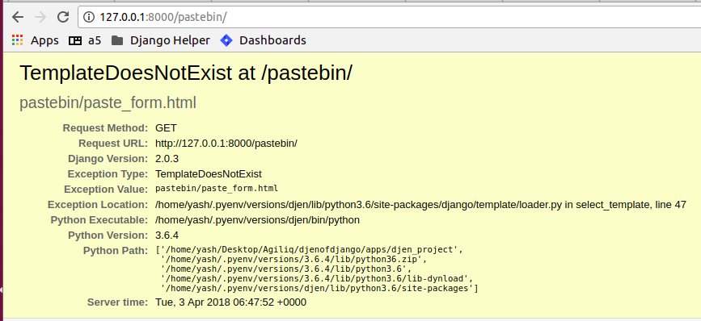
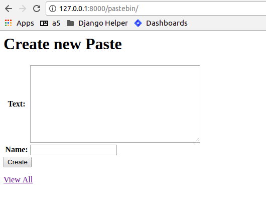
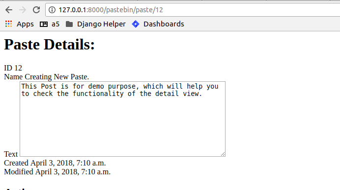

Chapter 3. Building a Pastebin.
--------------------------------

URL configuration - entry points
=================================

We have already noticed urls.py in our project. This controls our website's
points of entry. All incoming urls will be matched with the regexes in the 
``urlpatterns`` and the view corresponding to the first match will get to handle
the request. A request url that does not match any urlconf entry will be 404'ed.

.. note:: brush up regexes in python from `python docs 
          <http://docs.python.org/library/re.html>`_ or 
          `diveintopython <http://diveintopython.org/regular_expressions/index.html>`_

As an example from our previous app: ::

    from django.contrib import admin
    from django.urls import path

    urlpatterns = [
        path('admin/', admin.site.urls),
    ]

Now when we call http://127.0.0.1:8000/admin/ django matches that to the url entries. This urlconf
has included ``admin.urls`` which means that all further path matches will be done with the ``admin.urls``
module. Once again, the first match will get to handle the request. You can think of this as 'mounting' the 
admin app at ``/admin/``. You are of course free to change the 'mount point' to anything else you like.

A typical urlconf entry looks like this::

    (r'<regex>', <view_function>, <arg_dict>),

``regex`` is any valid python regex that has to be processed. This would be absolute in the project
urls.py and relative to the mount point in an app's urls.py

``view_function`` is a function that corresponds to this url. The function **must** return a ``HttpResponse``
object. Usually, shortcuts such as ``render``, are used though. More about views later.

``arg_dict`` is an optional dict of arguments that will be passed to the ``view_function``. In addition, options
can be declared from the url regex too. For example::

    path('object/<int:id>/', views.get_object)

will match all urls having an integer after ``object/``. Also, the value will be passed as ``object_id`` to the 
``get_object`` function.

Named urls:
+++++++++++

Usually, we would want an easier way to remember the urls so that we could refer them in views or templates.
We could *name* our urls by using the ``path`` constructor. For example::

    path(r'^welcome/$', 'app.views.welcome', name='welcome'),

This line is similar to the previous urls, but we have an option of passing a ``name`` argument. 

To get back the url from its name, django provides:

* ``django.url.reverse`` function for use in views

* ``url`` templatetag for use in templates

We will see how to use the templatetag in our templates.

.. note:: Also see http://agiliq.com/books/djangodesignpatterns/urls.html#naming-urls

Templates - skeletons of our website:
======================================

You must be wondering where all those pages came from, since we have not touched
any html yet. Well, since we used the admin app, we were able to rely on the admin
templates supplied with django.

A template is a structure of webpage that will be *rendered* using a *context* and returned as response if
you want it to. A ``django.template.Template`` object can be rendered using the ``render`` method.

Normally templates are html files with some extra django content, such as templatetags and variables. Note that our
templates need not be publicly accessible(in fact they shouldn't be) from a webserver. They are not meant to be displayed
directly; django will process them based on the request, context etc and respond with the rendered templates.

In case you want a template to be directly accessible (e.g. static html files), you could use the ``django.views.generic.TemplateView``
generic view.

Template Loaders:
+++++++++++++++++

By default, Django uses a filesystem-based template loader, but Django comes with a few other template loaders, which know how to load templates from other sources.

Some of these other loaders are disabled by default, but you can activate them by adding a 'loaders' option to your DjangoTemplates backend in the TEMPLATES setting or passing a loaders argument to Engine. loaders should be a list of strings or tuples, where each represents a template loader class. Here are the template loaders that come with Django:

`django.template.loaders.filesystem.Loader` ::

    TEMPLATES = [{
        'BACKEND': 'django.template.backends.django.DjangoTemplates',
        'OPTIONS': {
            'loaders': [
                (
                    'django.template.loaders.filesystem.Loader',
                    [os.path.join(BASE_DIR, 'templates')],
                ),
            ],
        },
    }]

`django.template.loaders.app_directories.Loader`

Loads templates from Django apps on the filesystem. For each app in INSTALLED_APPS, the loader looks for a templates subdirectory. If the directory exists, Django looks for templates in there.

This means you can store templates with your individual apps. This also makes it easy to distribute Django apps with default templates.

For example, for this setting: ::

    INSTALLED_APPS = ['cd_library', 'pastebin']

You can enable this loader simply by setting APP_DIRS to True: ::

    TEMPLATES = [{
        'BACKEND': 'django.template.backends.django.DjangoTemplates',
        'APP_DIRS': True,
    }]

Context:
++++++++

A context is a dict that will be used to render a page from a template. All context keys are valid template
variables.

To display a user name in your template, suppose you provide the ``username`` in your context, you could do:

.. sourcecode:: django

    Hello {{ username }}

When this template is rendered using (e.g. using ``render``), ``username`` will be replaced with its value

You can pass any variable to the context, so you can call a dict's key, or an objects property. However you cannot pass
any arguments to the property.

For example:

.. sourcecode:: django

    Hello {{ user.username }}

can be used to get ``user['username']`` or ``user.username``

Similarly:

.. sourcecode:: django

    <a hef="{{ user.get_absolute_url }}">{{ user.username }}</a>

can be used to get ``user.get_absolute_url()``

Templatetags:
+++++++++++++

Templatetags are helpers to the template. Suppose you have an ``iterable`` with a list of objects in your context:

.. sourcecode:: django

    
        {{ object }}
    

would render them. If this is a html template, we would prefer:

.. sourcecode:: django

    
    <ul>
        
            <li>
                {{ object }}
            </li>
        
    </ul>
    

which would render the objects in html unordered list.

Note that ```` ```` ```` ```` are all built-in templatetags.
If and for behave very much like their python counterparts.

Common templatetags and template inheritance:
++++++++++++++++++++++++++++++++++++++++++++++

Some templatetags we will use in our application:

* ``url`` 
  
This templatetag takes a named url or view function and renders the url as found by ``reverse``

  For example:
  
.. sourcecode:: django

    <a href="">View All</a>

would output

.. sourcecode:: html

    <a href="/pastebin/pastes/">View All</a>

It also takes arguments:

.. sourcecode:: django

    <a href="">{{ paste }}</a>

would output

.. sourcecode:: html

    <a href="/pastebin/paste/9">Sample Paste</a>

.. note:: You must make sure the correct urlconf entry for the given url exists. If the url entry
          does not exist, or the number of arguments does not match, this templatetag will raise a 
          ``NoReverseMatch`` exception.

* ``csrf_token`` 

  This is a security related tag used in forms to prevent cross site request forgery.

* ``include <template>``

  This will simply include any file that can be found by the ``TEMPLATE_LOADERS`` where it is called

* ``extends <template>``

  This will extend another template and provides template inheritance. You can have a ``base`` template and
  have other specific template extend the ``base`` template.

* ``block`` and ``endblock``

  ``blocks`` are used to customize the ``base`` page from a ``child`` page. If the ``base`` page defines a block called
   ``head``, the child page can override that block with its own contents.

* ``load``

  This is used to load custom templatetags. More about writing and using custom templatetags later.

We will see later how to add custom templatetags.

Filters:
++++++++

Filters are simple functions which operate on a template variable and manipulate them.

For example in our previous template:

.. sourcecode:: django

    Hello {{ username|capfirst }}

Here ``capfirst`` is a filter that will capitalize the first char our ``username``

.. note:: Reference of built-in templatetags and filters:
          https://docs.djangoproject.com/en/2.0/ref/templates/builtins/

Templates are not meant for programming:
++++++++++++++++++++++++++++++++++++++++

One of the core django philosophy is that templates are meant for rendering the context and
optionally making a few aesthetic changes only. Templates should not be used for handling 
complex queries or operations. This is also useful to keep the programming and designing aspects
of the website separate. Template language should be easy enough to be written by designers.

Generic views - commonly used views:
====================================

Views:
++++++

Views are just functions which take the ``HttpRequest`` object,  and some optional arguments,
then do some work and return a ``HttpResponse`` page. Use ``HttpResponseRedirect`` to redirect
to some other ``url`` or ``HttpResponseForbidden`` to return a ``403 Forbidden`` response.

By convention, all of an app's views would be written in <app>/views.py

A simple example to return "Hello World!" string response:

.. sourcecode:: python

    from django.http import HttpResponse

    def hello_world(request):
        return HttpResponse("Hello World!")

To render a template to response one would do:

.. sourcecode:: python

    from django.http import HttpResponse
    from django.template import loader

    def hello_world(request):
        template = loader.get_template("hello_world.html")
        context = {"username": "Monty Python"}
        return HttpResponse(template.render(context))

But there's a simpler way:

.. sourcecode:: python

    from django.shortcuts import renders

    def hello_world(request):
	    return render(request,"hello_world.html", {"username": "Monty Python"})

Generic Views:
+++++++++++++++

Django’s generic views were developed to ease that pain.They take certain common
idioms and patterns found in view development and abstract them so that you can
quickly write common views of data without having to write too much code.

Extending Generic Views
++++++++++++++++++++++++

There’s no question that using generic views can speed up development substantially.
In most projects, however, there comes a moment when the generic views no longer suffice.
Indeed, the most common question asked by new Django developers is how to make generic
views handle a wider array of situations.

This is one of the reasons generic views were redesigned for the 1.3 release - previously,
they were just view functions with a bewildering array of options; now, rather than passing
in a large amount of configuration in the URLconf, the recommended way to extend generic views
:Qis to subclass them, and override their attributes or methods.

.. note:: reference: https://docs.djangoproject.com/en/2.0/topics/class-based-views/generic-display/

Designing a pastebin app:
=========================

In this chapter we will be designing a simple pastebin. Our pastebin will be able to

    * Allow users to paste some text

    * Allow users to edit or delete the text

    * Allow users to view all texts

    * Clean up texts older than a day

Some 'views' that the user will see are

    * A list view of all recent texts

    * A detail view of any selected text

    * An entry/edit form for a text

    * A view to delete a text

Our work flow for this app would be

    * sketch the models

    * route urls to generic views

    * use generic views with our models

    * write the templates to use generic views

So let's dive in:

Sketch the models:
==================

We have only one object to store to the database which is 
the text pasted by the user. Let's call this Paste.

Some things our Paste model would need to handle are

    * Text pasted by the user

    * Optional file name

    * Created time

    * Updated time

The time fields would be useful for getting 'latest' or 'recently updated'
pastes.

So let's get started::

    python manage.py startapp pastebin

In pastebin/models.py ::

    from django.db import models

    # Create your models here.
    class Paste(models.Model):
        text = models.TextField()
        name = models.CharField(max_length=40, null=True, blank=True)
        created_on = models.DateTimeField(auto_now_add=True)
        updated_on = models.DateTimeField(auto_now=True)

        def __unicode__(self):
            return self.name or str(self.id)

.. note::

    * auto_now_add automatically adds current time to the created_on
      field when an object is added.

    * auto_now is similar to the above, but it adds the current time to
      the updated_on field each time an object is saved.

    * the id field is primary key which is autocreated by django. Since
      name is optional, we fall back to the id which is guaranteed.

Adding our app to the project ::

    INSTALLED_APPS = [
        'django.contrib.admin',
        'django.contrib.auth',
        'django.contrib.contenttypes',
        'django.contrib.sessions',
        'django.contrib.messages',
        'django.contrib.staticfiles',
        'cd_library',
        'pastebin',
    ]

Makemigrations and Migrate::

    $ python manage.py makemigrations
    Migrations for 'pastebin':
      pastebin/migrations/0001_initial.py
        - Create model Paste
    $ python manage.py migrate
    Operations to perform:
        Apply all migrations: admin, auth, cd_library, contenttypes, pastebin, sessions
    Running migrations:
        Applying pastebin.0001_initial... OK

There, we have our pastebin models ready.

Configuring urls:
=================

We have already seen how to include the admin urls in urls.py. But now, we want to have
our app take control of the urls and direct them to generic views. Here's how

Let's create urls.py in our app. Now our pastebin/urls.py should look like

.. sourcecode:: python

    from django.urls import path
    from .views import PasteCreate

    urlpatterns = [
        path(r'', PasteCreate.as_view(), name='create'),
    ]

Notes:

* Each urlpatterns line is a mapping of urls to views

  ``path(r'', PasteCreate.as_view(), name='create'),``

* Here the url is ``''`` will be matched with the incoming request.
  If a match is found, the request is forwarded to the corresponding view.

* The scope goes to class based generic view, which is written in our :code:`views.py`.

.. sourcecode:: python

    from django.views.generic.edit import CreateView
    from .models import Paste

    class PasteCreate(CreateView):
        model = Paste
        fields = ['text','name']

Let's tell the project to include our app's urls

.. sourcecode:: python

    from django.contrib import admin
    from django.urls import path, include

    urlpatterns = [
        path('admin/', admin.site.urls),
        path('pastebin/', include('pastebin.urls')),
    ]

Now django knows to forward urls starting with ``/pastebin`` to the pastebin app. All urls relative to this url
will be handled by the pastebin app. That's great for reusability.

If you try to open http://127.0.0.1/pastebin at this point, you will be greeted with a TemplateDoesNotExist error.
If you observe, the error message says that django cannot find ``pastebin/paste_form.html``. Usually getting this error means that
django was not able to find that file.

The default template used by CreateView is '<app>/<model>_form.html'. In our case this would be ``pastebin/paste_form.html``.

Let's create this template. In ``templates/pastebin/paste_form.html``:

.. sourcecode:: html

    <h1>Create new Paste</h1>
    <form action="" method="POST">
        
        <table>
            {{ form.as_table }}
        </table>
        <input type="submit" name="create" value="Create">
    </form>

    <a href="">View All</a>

Just after adding the template we an refresh the page. We will se our webpage as.

.. TODO::

    This is not the right place to discuss templates, introduce templates, context, RequestContext in first chapter

Observe that:

* the form has been autogenerated by django's forms library by using the ``Paste`` model

* to display the form, all you have to do is render the ``form`` variable

* form has a method ``as_table`` that will render it as table, other options are ``as_p``, ``as_ul``
  for enclosing the form in ``
`` and ``<ul>`` tags respectively

* form does not output the form tags or the submit button, so we will have to write them down
  in the template

* you need to include ``csrf_token`` tag in every form posted to a local view. Django uses this to prevent
  cross site request forgery

* the generated form includes validation based on the model fields

Now, we need a page to redirect successful submissions to. We can use the detail view page of a paste here.

For this, we will use the ``django.views.generic.detail.DetailView``

.. sourcecode:: python

    from django.views.generic.detail import DetailView
    from .models import Paste
    from django.views.generic.edit import CreateView

    class PasteCreate(CreateView):
        model = Paste
        fields = ['text','name']

    class PasteDetail(DetailView):
        model = Paste
        template_name = "pastebin/paste_detail.html"

Related urls:

.. sourcecode:: python

    from django.urls import path
    from .views import PasteList, PasteDetail, PasteCreate

    urlpatterns = [
        path('', PasteCreate.as_view(), name='create'),
        path('paste/<int:pk>', PasteDetail.as_view(), name='pastebin_paste_detail'),
    ]

Using this generic view we will be able to display the details about the paste object with a given id. Note that:

* model and template_name are the arguments passed to DetailView. (ProjectDetailView)

* we are naming this view using the url constructor and passing the ``name`` argument. This name can be referred to
  from views or templates and helps in keeping this DRY.

* the DetailView view will render the ``pastebin/paste_detail.html`` template. We need to write down this
  template for this view to work.

In ``templates/pastebin/paste_detail.html``:

.. sourcecode:: html

    <label>Paste Details: </label>
    

        

            <label>ID</label>
            {{ object.id }}
        

        

            <label>Name</label>
            {{ object.name }}
        

        

            <label>Text</label>
            {{ object.text }}
        

        

            <label>Created</label>
            {{ object.created_on }}
        

        

            <label>Modified</label>
            {{ object.updated_on }}
        

    

Now, that we have a create view and a detail view, we just need to glue them together. We can do this in two ways:

* pass the ``post_save_redirect`` argument in ``create_object`` view

* set the ``get_absolute_url`` property of our Paste model to its detail view. ``create_object`` view will call the object's
  ``get_absolute_url`` by default

I would choose the latter because it is more general. To do this, change your Paste model and add the get_absolute_url property:

.. sourcecode:: python

    from django.db import models

    class Paste(models.Model):
        text = models.TextField()
        name = models.CharField(max_length=40, null=True, blank=True)
        created_on = models.DateTimeField(auto_now_add=True)
        updated_on = models.DateTimeField(auto_now=True)

        def __unicode__(self):
            return self.name or str(self.id)

        @models.permalink
        def get_absolute_url(self):
            return ('pastebin_paste_detail', [self.id])

Note that:

* We could have returned ``'/pastebin/paste/%s' %(self.id)'`` but it would mean defining the same url twice and it violates the DRY principle.
  Using the ``models.permalink`` decorator, we can tell django to call the url named ``pastebin_paste_detail`` with the parameter ``id``

And so, we are ready with the create object and object detail views. Try submitting any pastes and you should be redirected to the details of 
your paste.

Now, on to our next generic view, which is ListView:

.. sourcecode:: python

    from django.urls import path
    from .views import PasteList, PasteDetail, PasteCreate

    urlpatterns = [
        path('', PasteCreate.as_view(), name='create'),
        path('pastes/', PasteList.as_view(), name='pastebin_paste_list'),
        path('paste/<int:pk>', PasteDetail.as_view(), name='pastebin_paste_detail'),
    ]

This is simpler than the detail view, since it does not take any arguments in the url. The default template for this view is ``pastebin/paste_list.html``
so let's fill that up with:

.. sourcecode:: html

    
        <h1>Recent Pastes:</h1>
    <ul>
        
        <li>
            <a href="">{{ paste }}</a>
        </li>
        
    </ul>
    
        <h1>No recent pastes</h1>
    

Note that

* We have used the ``url`` template tag and passed our named view i.e. ``pastebin_paste_detail`` to get the url to a specific paste

Similarly, our update and delete generic views would look like

.. sourcecode:: python

    from django.urls import path
    from .views import PasteList, PasteDetail, PasteDelete, PasteUpdate, PasteCreate

    urlpatterns = [
        path('', PasteCreate.as_view(), name='create'),
        path('pastes/', PasteList.as_view(), name='pastebin_paste_list'),
        path('paste/<int:pk>', PasteDetail.as_view(), name='pastebin_paste_detail'),
        path('paste/delete/<int:pk>', PasteDelete.as_view(), name='pastebin_paste_delete'),
        path('paste/edit/<int:pk>', PasteUpdate.as_view(), name='pastebin_paste_edit'),
    ]

Note that the ``delete_object`` generic view requires an argument called ``post_delete_redirect`` which will be used to redirect the user
after deleting the object.

We have used update_object, delete_object for the update/delete views respectively. Let's link these urls from the detail page:

.. sourcecode:: html

    
        

        <ul>
        
            <li class="{{ message.tag }}">
                {{ message }}
            </li>
            
        </ul>
        

    

    <h1>Paste Details: </h1>
    

        

            <label>ID</label>
            {{ object.id }}
        

        

            <label>Name</label>
            {{ object.name }}
        

        

            <label>Text</label>
            <textarea rows="10" cols="50" OnClick="this.select();" readonly="true">{{ object.text }}</textarea>
        

        

            <label>Created</label>
            {{ object.created_on }}
        

        

            <label>Modified</label>
            {{ object.updated_on }}
        

    

    <h2>Actions</h2>
        <ul>
            <li>
                <a href="">Edit this paste</a>
            </li>
            <li>
                <a href="">Delete this paste</a>
            </li>
        </ul>

    <a href="">View All</a>

Our :code:`views.py` for complete pastebin looks like

.. sourcecode:: python

    from django.urls import reverse_lazy
    from django.views.generic import DeleteView
    from django.views.generic.edit import CreateView, UpdateView
    from django.views.generic.detail import DetailView
    from django.views.generic.list import ListView
    from .models import Paste

    class PasteCreate(CreateView):
        model = Paste
        fields = ['text','name']

    class PasteList(ListView):
        model = Paste
        template_name = "pastebin/paste_list.html"
        queryset = Paste.objects.all()
        context_object_name = 'queryset'

    class PasteDetail(DetailView):
        model = Paste
        template_name = "pastebin/paste_detail.html"

    class PasteDelete(DeleteView):
        model = Paste
        success_url = reverse_lazy('pastebin_paste_list')

    class PasteUpdate(UpdateView):
        model = Paste
        fields = ['text', 'name']

Note that the delete view redirects to a confirmation page whose template name is ``paste_confirm_delete.html`` if called using GET method.
Once in the confirmation page, we need need to call the same view with a POST method. The view will delete the object and pass a message using 
the messages framework.

.. sourcecode:: html

    <h1>Really delete paste {{ object }}?</h1>
    <h2>This action cannot be undone</h2>
    <form action="" method="POST">
        
        <input type="submit" value="Delete">
    </form>

Let's handle the message and display it in the redirected page.

.. sourcecode:: html

    
        

        <ul>
        
            <li class="{{ message.tag }}">
                {{ message }}
            </li>
            
        </ul>
        

    

    
        <h1>Recent Pastes:</h1>
    <ul>
        
        <li>
            <a href="">{{ paste }}</a>
        </li>
        
    </ul>
    
        <h1>No recent pastes</h1>
    

    <a href="">Create new</a>

While we are at it, Let's also include the messages in paste detail page, where create/update view sends the messages:

.. sourcecode:: html

    
        

        <ul>
        
            <li class="{{ message.tag }}">
                {{ message }}
            </li>
            
        </ul>
        

    

    <h1>Paste Details: </h1>
    

        

            <label>ID</label>
            {{ object.id }}
        

        

            <label>Name</label>
            {{ object.name }}
        

        

            <label>Text</label>
            <textarea rows="10" cols="50" OnClick="this.select();" readonly="true">{{ object.text }}</textarea>
        

        

            <label>Created</label>
            {{ object.created_on }}
        

        

            <label>Modified</label>
            {{ object.updated_on }}
        

    

    <h2>Actions</h2>
        <ul>
            <li>
                <a href="">Edit this paste</a>
            </li>
            <li>
                <a href="">Delete this paste</a>
            </li>
        </ul>

    <a href="">View All</a>

So we now have pages to create, update, delete and view all pastes.

Now, for better maintenance, we would like to delete all pastes that have not been updated in a day using an script.
We will use django's custom management scripts for this.

Writing custom management scripts:
===================================

Just like other manage.py subcommands such as ``migrations``, ``shell``, ``startapp`` and ``runserver``, we can have custom subcommands to
help us maintain the app.

For our subcommand to be registered with manage.py, we need the following structure in our app::

    .
    |-- __init__.py
    |-- management
    |   |-- commands
    |   |   `-- __init__.py
    |   `-- __init__.py
    |-- models.py
    |-- tests.py
    |-- urls.py
    `-- views.py

All scripts inside ``management/commands/`` will be used as custom subcommands. Let's create ``delete_old.py`` subcommand:

.. sourcecode:: python

    import datetime

    from django.core.management.base import BaseCommand

    from pastebin.models import Paste

    class Command(BaseCommand):
        help = """
                deletes pastes not updated in last 24 hrs

                Use this subcommand in a cron job
                to clear older pastes
               """

        def handle(self, **options):
            now = datetime.datetime.now()
            yesterday = now - datetime.timedelta(1)
            old_pastes = Paste.objects.filter(updated_on__lte=yesterday)
            old_pastes.delete()

Here:

* We subclass either of the ``BaseCommand``, ``LabelCommand`` or ``AppCommand`` from ``django.core.management.base``. ``BaseCommand``
  suits our need because we dont need to pass any arguments to this subcommand.

* ``handle`` will be called when the script runs. This would be ``handle`` for other Command types.

* We have used the ``lte`` lookup on ``updated_on`` field to get all posts older than a day. Then we delete them using ``delete`` method
  on the queryset.

You can test if the subcommand works by doing::

    python manage.py delete_old

Now we can configure this script to run daily using cronjob or something similar.

