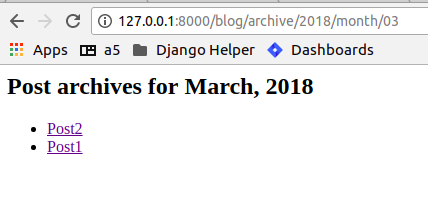
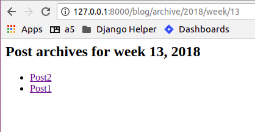

Chapter 4. Building a Blog
----------------------------
..
    (Topics introduced: Authentication, Session management, NewForms, Generating simple RSS feeds. Date based generic views.)
    
    Diving in. [Code listing]
    
    Authentication. [In chapter 2, all views were managed by Admin, so we did not need to handle authentication. In chapter 3, all views would be public, so no authentication was needed. In this chapter we need to restrict access to only logged in user, so we introduce it here.]
    Using django.contrib.auth
    Using login_required decorator to restrict access to logged in users.
    Using request.user in views, for finer control over views.
    Using context processors to use logged in users in templates.

    Session Management. [So once user has commented, their name/email information is stored.]  
    The machinery behind sessions framework.
    Using cookies.
    Using session to abstract handling cookies.
    
    Newforms. [Comment, Post, Settings form]
    Using newforms.
    Using model form to auto generate forms for model.
    Creating complex forms programatically. (Instead of defining them.)
    
    Generating RSS feeds.
    Using django.contrib.syndication to generate feeds for the Blog.
    
    Using date based generic views to generate monthly and weekly archives for the blog.

Topics in this chapter:
=======================

So far, we have seen how to use django's admin interface, and generic views. In this chapter we
will write custom views and blog entry admin page, store some user details in the session
and use date based generic views for our blog archives.

Models with ForeignKeys:
++++++++++++++++++++++++

To link two Models, we use foreign keys. Since we may have many comments for a blog post, we would like
to have a relation from the comment model to the post model. This can be done by using a model field of
the type 'ForeignKey'. It requires a string or class representing the Model to which the ForeignKey is to
be created. We would also need ForeignKey to link each blog post to it's owner, since we want only the admin
to be able to create a post.

As we shall see, django simplifies access to foreign keys by automatically creating a related object set
on the linked Model.

.. sourcecode:: python

    class Post(models.Model):
        text = models.TextField()
        ...
        ...

    class Comment(models.Model):
        text = models.CharField(max_length=100)
        post = models.ForeignKey(Post)
        ...
        ...

would relate each ``Post`` to multiple ``Comment``

Now, to fetch all comments related to a Post, we can use

.. sourcecode:: python

    post = Post.objects.get(pk=1)
    comments = post.comment_set.all()

So, ``post`` gets a ``<ForeignKeyModel>_set`` property which is actually the ``Manager`` for ``Comments``
related to that ``post``.

ModelForms:
+++++++++++

We have already seen how the ``admin`` app creates the form for our model by inspecting its fields. If we want to
customize the autogenerated forms, we can use ModelForms. In this chapter we see how to use ModelForms to create
and customize the forms for post and comment models. By convention, all custom forms should be in <app>/forms.py

The simplest way to use ModelForms would be:

.. sourcecode:: python

    class PostForm(ModelForm):
        class Meta:
            model = Post

The autogenerated fields can be overridden by explicitly specifying the field.
To change the html widget and label used by ``text`` field of ``Post`` model, one would do:

.. sourcecode:: python

    class PostForm(ModelForm):
        text = forms.CharField(widget=forms.TextArea, label='Entry')
        class Meta:
            model = Post

Custom views with forms and decorators:
++++++++++++++++++++++++++++++++++++++++

We will write our custom views in this chapter. We have already introduced views in the previous chapter, so we will
see how to use forms in our views and how to limit access to certain views using decorators.

.. sourcecode:: python

    form = PostForm(request.POST or None)

Here we are handling GET and POST in the same view. If this is a GET request, the form would be empty else it would be filled
with the POST contents.

.. sourcecode:: python

    form.is_valid

validates the form and returns ``True`` or ``False``

We will use these two together to save a valid form or display empty form.

To restrict views to a condition, we can use the ``user_passes_test`` decorator from ``contrib.auth``.
The decorator takes a callable which should perform the test on the ``user`` argument and return ``True`` or ``False``. 
The view is called only when the user passes the test. If the user is not logged in or does not pass the test,
it redirects to ``LOGIN_URL`` of settings. By default this is ``/accounts/login`` and we will handle this url from urls.py

Some other useful decorators are:

* ``django.contrib.admin.views.decorators import staff_member_required``

  Restricts view to staff members only.

* ``django.contrib.auth.decorators.login_required``

  Restricts view to logged in users only

Our blog app:
=============

Let's list out the features we would want to see in our blog:

* Create/Edit blog post (restricted to admin)

* View blog post (public)

* Comment on a blog post (anonymous)

* Store anonymous user details in session

* Show month based blog archives

* Generate RSS feeds

We have two models here: ``Post`` and ``Comment``. The data we would like store are:

For Post:

* Title

* Text Content

* Slug

* Created Date

* Author

For Comment:

* Name

* Website

* Email

* Text Content

* Post related to this comment

* Created Date

.. note:: 
    Since we want anonymous to be able to comment on a post, we are not relating the comment poster
    to a registered user.

We want the ``author`` field of the post to be mapped to a registered user and the ``post`` field
to be mapped to a valid ``Post``. As we shall see, we will ForeignKeys to the appropriate models
to manage these.

Models:
+++++++

We have already seen how to create and integrate an app into our project, so I will start with the models

.. sourcecode:: python

    from django.db import models
    from django.template.defaultfilters import slugify

    from django.contrib.auth.models import User

    class Post(models.Model):
        title = models.CharField(max_length=100)
        slug = models.SlugField(unique=True)
        text = models.TextField()
        created_on = models.DateTimeField(auto_now_add=True)
        author = models.ForeignKey(User, on_delete=models.CASCADE)

        def __str__(self):
            return self.title

        @models.permalink
        def get_absolute_url(self):
            return ('blog_post_detail', (),
                    {
                        'slug' :self.slug,
                    })

        def save(self, *args, **kwargs):
            if not self.slug:
                self.slug = slugify(self.title)
            super(Post, self).save(*args, **kwargs)

    class Comment(models.Model):
        name = models.CharField(max_length=42)
        email = models.EmailField(max_length=75)
        website = models.URLField(max_length=200, null=True, blank=True)
        text = models.TextField()
        post = models.ForeignKey(Post, on_delete=models.CASCADE)
        created_on = models.DateTimeField(auto_now_add=True)

        def __str__(self):
            return self.text

Quite a few new things here, let's analyze them:

* slug field - it is used for storing slugs (e.g. this-is-a-slug). SEO or something.

* We will be using slugs in the url to fetch a blog post, so this must be unique.

* ``slugify`` is a helper function to get slug from a string. We won't need to get the slug from the form,
  we will generate it ourself using ``slugify``

* To autogenerate the slug, we override the ``model`` save method, whose signature is ``save(self, *args, **kwargs)``
  We set ``self.slug`` to the slug generated by ``slugify`` and call the parent ``save`` method.

* This ensures that every time a model is saved, it will have a slug field.

* The ``get_absolute_url`` of the ``Post`` model points to the ``blog_post_detail`` which takes a ``slug`` parameter. 
  This is the ``Post`` detail view, and it fetches the post based on the ``slug``. We will soon see how this is implemented.

* ``model.ForeignKey`` is a ForeignKey field which can be used to link this model to any other model. Here we want to link the ``author``
  field to a ``User``, which is django's model for a user. It comes from ``django.contrib.auth`` app, which is another useful package
  shipped with django.

* Similarly to link a ``Comment`` to a ``Post`` we have a ForeignKey from in the ``post`` field of the comment.

* We won't need the ``author`` field from the ``Post`` form either, but we will fill it up in the view, where we have access to the 
  logged in user details

Views:
++++++

The views we would need are:

* Admin should be able to login

* Add/Edit a post - restricted to admin

* View a blog post

* Comment on a blog post

We need to customize our forms to only display fields which need user input, because we will take care of the rest. For example, we have already
seen how to autofill slug field. Next, we would like to autofill ``post`` for ``Comment`` and ``author`` for ``Post`` in the view. Heres our
``blog/forms.py``

.. sourcecode:: python

    from django import forms

    from .models import Post, Comment

    class PostForm(forms.ModelForm):
        class Meta:
            model = Post
            exclude = ['author', 'slug']

    class CommentForm(forms.ModelForm):
        class Meta:
            model = Comment
            exclude = ['post']

For login, we will use ``django.contrib.auth.views.login`` view which is included in the ``contrib.auth`` app. It expects a ``registration/login.html``
which we will steal from ``django/contrib/admin/templates/admin/login.html``. We will include the login url in the project urls.

.. sourcecode:: python

    from django.contrib import admin
    from django.urls import path, include
    from django.contrib.auth.views import login

    urlpatterns = [
        path('accounts/login/', login),
        path('admin/', admin.site.urls),
        path('pastebin/', include('pastebin.urls')),
        path('blog/', include('blog.urls')),
        ]

In ``templates/registration/login.html``, copy contents from ``django/contrib/admin/templates/admin/login.html``

For the others, we will write custom views in ``blog/views.py``.

.. sourcecode:: python

    from django.contrib.auth.decorators import user_passes_test
    from django.shortcuts import redirect, render_to_response, get_object_or_404, render

    from .models import Post
    from .forms import PostForm, CommentForm

    @user_passes_test(lambda u: u.is_superuser)
    def add_post(request):
        form = PostForm(request.POST or None)
        if form.is_valid():
            post = form.save(commit=False)
            post.author = request.user
            post.save()
            return redirect(post)
        return render(request, 'blog/add_post.html',{ 'form': form })

    def view_post(request, slug):
        post = get_object_or_404(Post, slug=slug)
        form = CommentForm(request.POST or None)
        if form.is_valid():
            comment = form.save(commit=False)
            comment.post = post
            comment.save()
            return redirect(request.path)
        return render(request, 'blog/blog_post.html',{'post': post,'form': form,})

Note:

* The ``user_passes_test`` decorator whether the user is admin or not. If not, it will redirect the user to login page.

* We are using the ``ModelForms`` defined in ``forms.py`` to autogenerate forms from our Models.

* ``ModelForm`` includes a ``save`` method (just like a ``Models`` save method) which saves the model data to the database.

* ``commit=False`` on a form save gives us the temporary ``Model`` object so that we can modify it and save permanently.
  Here, we have used it to autofill the ``author`` of ``Post`` and ``post`` of ``Comment``

* ``redirect`` is a shortcut that redirects using ``HttpResponseRedirect`` to another url or a model's ``get_absolute_url`` property.

Templates:
++++++++++

The corresponding templates for these views would look like:

``blog/templates/blog/add_post.html``:

.. sourcecode:: html

    <h2>Hello {{ user.username }}</h2>
     
    <h2>Add new post</h2>
    <form action="" method="POST">
        
        <table>
            {{ form.as_table }}
        </table>
        <input type="submit" name="add" value="Add" />
    </form>

``blog/templates/blog/blog_post.html``:

.. sourcecode:: html

    <h2>{{ post.title }}</h2>
    

        

            {{ post.text }}
        

        
            Written by {{ post.author }}  on {{ post.created_on }}
        
    

    
    <h2>Comments</h2>
    

        
            
                <a href="{{ comment.website }}">{{ comment.name }}</a> said on {{ comment.created_on }}
            
            

                {{ comment.text }}
            

        
    

    

     

    <h2>Add Comment</h2>

    <form action="" method="POST">
        
        <table>
            {{ form.as_table }}
        </table>
        <input type="submit" name="submit" value="Submit" />
    </form>

.. note::

    Since ``Comment`` has a ForeignKey to ``Post``, each ``Post`` object automatically gets a 
    ``comment_set`` property which provides an interface to that particular ``Post``'s comments.

Sessions:
+++++++++

So far we have most of the blog actions covered. Next, let's look into sessions:

Suppose we want to store the commenter's details in the session so that he/she does not have to fill them again. 

.. sourcecode:: python

    from django.contrib.auth.decorators import user_passes_test
    from django.shortcuts import redirect, render_to_response, get_object_or_404, render

    from .models import Post
    from .forms import PostForm, CommentForm

    @user_passes_test(lambda u: u.is_superuser)
    def add_post(request):
        form = PostForm(request.POST or None)
        if form.is_valid():
            post = form.save(commit=False)
            post.author = request.user
            post.save()
            return redirect(post)
        return render(request, 'blog/add_post.html',{ 'form': form })

    def view_post(request, slug):
        post = get_object_or_404(Post, slug=slug)
        form = CommentForm(request.POST or None)
        if form.is_valid():
            comment = form.save(commit=False)
            comment.post = post
            comment.save()
            request.session["name"] = comment.name
            request.session["email"] = comment.email
            request.session["website"] = comment.website
            return redirect(request.path)
        form.initial['name'] = request.session.get('name')
        form.initial['email'] = request.session.get('email')
        form.initial['website'] = request.session.get('website')
        return render(request, 'blog/blog_post.html',{'post': post,'form': form,})

Note that the ``form.initial`` attribute is a ``dict`` that holds initial data of the form. A session lasts until the user logs out or 
clears the cookies (e.g. by closing the browser). django identifies the session using ``sessionid`` cookie.

The default session backend is ``django.contrib.sessions.backends.db`` i.e. database backend, but it can be configured to ``file`` or ``cache`` backend as well.

Date based generic views:
=========================

.. note:: reference: https://docs.djangoproject.com/en/2.0/ref/class-based-views/generic-date-based/

Add code of date based views to the :code:`blog/views.py` so as to make it work.

.. sourcecode:: python

    from django.contrib.auth.decorators import user_passes_test
    from django.shortcuts import redirect, render_to_response, get_object_or_404, render
    from django.views.generic.dates import MonthArchiveView, WeekArchiveView

    from .models import Post
    from .forms import PostForm, CommentForm

    @user_passes_test(lambda u: u.is_superuser)
    def add_post(request):
        form = PostForm(request.POST or None)
        if form.is_valid():
            post = form.save(commit=False)
            post.author = request.user
            post.save()
            return redirect(post)
        return render(request, 'blog/add_post.html',{ 'form': form })

    def view_post(request, slug):
        post = get_object_or_404(Post, slug=slug)
        form = CommentForm(request.POST or None)
        if form.is_valid():
            comment = form.save(commit=False)
            comment.post = post
            comment.save()
            request.session["name"] = comment.name
            request.session["email"] = comment.email
            request.session["website"] = comment.website
            return redirect(request.path)
        form.initial['name'] = request.session.get('name')
        form.initial['email'] = request.session.get('email')
        form.initial['website'] = request.session.get('website')
        return render(request, 'blog/blog_post.html',{'post': post,'form': form,})

    class PostMonthArchiveView(MonthArchiveView):
        queryset = Post.objects.all()
        date_field = "created_on"
        allow_future = True

    class PostWeekArchiveView(WeekArchiveView):
        queryset = Post.objects.all()
        date_field = "created_on"
        week_format = "%W"
        allow_future = True

We will use date based generic views to get weekly/monthly archives for our blog posts:

.. sourcecode:: python

    from django.urls import path, include
    from .views import view_post, add_post, PostMonthArchiveView, PostWeekArchiveView

    urlpatterns = [
        path('post/<str:slug>', view_post, name='blog_post_detail'),
        path('add/post', add_post, name='blog_add_post'),
        path('archive/<int:year>/month/<int:month>', PostMonthArchiveView.as_view(month_format='%m'), name='blog_archive_month',),
        path('archive/<int:year>/week/<int:week>', PostWeekArchiveView.as_view(), name='blog_archive_week'),
            ]

``PostMonthArchiveView`` generic class based views outputs to ``post_archive_month.html`` and ``PostWeekArchiveView`` to ``post_archive_week.html``

.. sourcecode:: html

    <h2>Post archives for {{ month|date:"F" }}, {{ month|date:"Y" }}</h2>

    <ul>
        
            <li>
            <a href="">{{ post.title }}</a>
            </li>
        
    </ul>

.. sourcecode:: html

    <h2>Post archives for week {{ week|date:"W" }}, {{ week|date:"Y" }}</h2>

    <ul>
        
            <li>
            <a href="">{{ post.title }}</a>
            </li>
        
    </ul>

Now, blog archives should be accessible from ``/blog/archive/2018/month/03`` or ``/blog/archive/2018/week/16``

