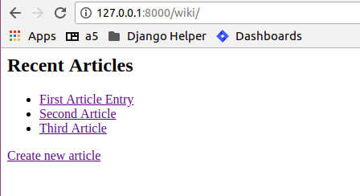
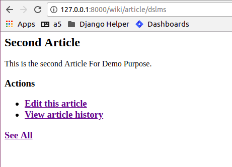
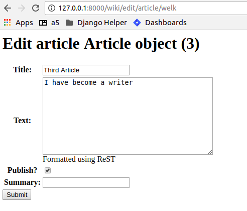
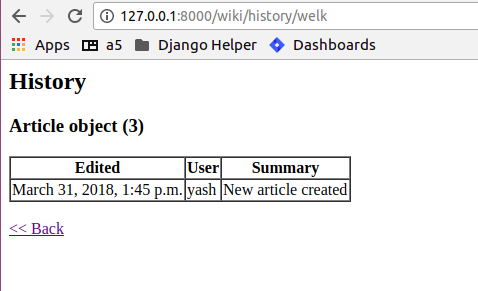

Chapter 5. Building a Wiki
-----------------------------
..
    (Topics introduced: Managing user registration using django-regsitration. Advanced ORM tricks. Overriding save for Entities. Signals. Websearches using Yahoo Devloper API.)

    Diving in. [Code listing]

    Managing user registration using django-regsitration.
    In the previous chapters we did not allow external users to create a user. Here a user can create an account on the wiki. This is managed using django-registration.
    Explanation of Django registration, its views and templates.
    Discussion of making reusable Django applications, taking Django-registration as example.
    
    Advanced ORM
    model.extra, How to use it to handle complex queries.
    Defining customer manager for models. (With a wiki, we reattach model.objects to a manager which only gets the latest object. Another custom manager, model.allobjects gets us all the elements.)
    Manager methods vs. classmethods.
    Overiding save, delete amd other model objects to enable versioning for objects.
    Introduce signals. (However we would not have used this in our code.)
    Show how signals could have been used for the same purpose, and compare.
    
    Websearches using Yahoo Developer API.  
    We want to make the wiki searchable, so instead of going via a local search system like Lucene, we use Yahoo Developer API. In this we can explain to use django.util.simplejson, to talk to external APIs which provide a JSON interface. 
  

A wiki application:
====================

In this chapter, we will build a wiki from scratch. Basic functionality includes:

* Article Management (CRUD) with ReST support

* Audit trail for articles

* Revision history

Article Management:
===================

This is similar to our last app (blog) in many ways. Significant changes would be:

* Allow administrator to add/edit an article.

* Allow ReST input instead of just plain text.

* Keep track of all edit sessions related to an article.

To demonstrate custom model managers, we would like to show only 'published' articles on the index page.

Let's write down the models:

.. sourcecode:: python

    from django.db import models
    from django.contrib.auth.models import User
    from django.template.defaultfilters import slugify

    class PublishedArticlesManager(models.Manager):
        def get_query_set(self):
            return super(PublishedArticlesManager, self).get_query_set().filter(is_published=True)

    class Article(models.Model):
        """Represents a wiki article"""

        title = models.CharField(max_length=100)
        slug = models.SlugField(max_length=50, unique=True)
        text = models.TextField(help_text="Formatted using ReST")
        author = models.ForeignKey(User, on_delete=models.CASCADE)
        is_published = models.BooleanField(default=False, verbose_name="Publish?")
        created_on = models.DateTimeField(auto_now_add=True)
        objects = models.Manager()
        published = PublishedArticlesManager()

        def __str__(self):
            return self.title

        def save(self, *args, **kwargs):
            if not self.slug:
                self.slug = slugify(self.title)
            super(Article, self).save(*args, **kwargs)

        @models.permalink
        def get_absolute_url(self):
            return ('wiki_article_detail', (), {'slug': self.slug})

    class Edit(models.Model):
        """Stores an edit session"""

        article = models.ForeignKey(Article, on_delete=models.CASCADE)
        editor = models.ForeignKey(User, on_delete=models.CASCADE)
        edited_on = models.DateTimeField(auto_now_add=True)
        summary = models.CharField(max_length=100)

        class Meta:
            ordering = ['-edited_on']

        def __str__(self):
            return "%s - %s - %s" % (self.summary, self.editor, self.edited_on)

        @models.permalink
        def get_absolute_url(self):
            return ('wiki_edit_detail', self.id)

Most of the code should be familiar, some things that are new:

* The Article model will hold all articles, but only those with ``is_published`` set to ``True`` will be displayed on the front page.

* We have a defined a custom model manager called ``PublishedArticlesManager`` which is a queryset that only returns the published articles.

* Non-published articles would be used only for editing. So, we retain the default model manager by setting ``objects`` to ``models.Manager``

* Now, to fetch all articles, one would use ``Articles.objects.all``, while ``Artilces.published.all`` would return only published articles.

* A custom manager should subclass ``models.Manager`` and define the custom ``get_query_set`` property.

* The ``Edit`` class would hold an edit session by a registered user on an article.

* We see the use of ``verbose_name`` and ``help_text`` keyword arguments. By default, django will replace ``_`` with spaces and Capitalize
  the field name for the label. This can be overridden using ``verbose_name`` argument. ``help_text`` will be displayed below a field in 
  the rendered ``ModelForm``

* The ``ordering`` attribute of meta class for ``Edit`` defines the default ordering in which ``edits`` will be returned. This can also be done
  using ``order_by`` in the queryset.

Now, we will need urls similar to our previous app, plus we would need a url to see the article history.

.. sourcecode:: python

    from django.urls import path, include
    from .views import add_article, edit_article, article_history, ArticleList, ArticleDetail

    urlpatterns = [
        path('', ArticleList.as_view(), name='wiki_article_index'),
        path('article/<str:slug>',ArticleDetail.as_view(),name='wiki_article_detail'),
        path('history/<str:slug>', article_history, name='wiki_article_history'),
        path('add/article', add_article, name='wiki_article_add'),
        path('edit/article/<str:slug>', edit_article, name='wiki_article_edit'),
    ]

Note that:

* We will use the ``DetailView`` generic views for the article index page and detail page.

* Similarly, it would be better to write down custom views for edit article and article history pages.

Here are the forms we will need:

.. sourcecode:: python

    from django import forms

    from .models import Article, Edit

    class ArticleForm(forms.ModelForm):
        class Meta:
            model = Article
            exclude = ['author', 'slug']

    class EditForm(forms.ModelForm):
        class Meta:
            model = Edit
            fields = ['summary']

Here:

* We are excluding ``author`` and ``slug`` which will be autofilled.

* We are inluding the ``summary`` field in ``Edit`` model only. The other fields (``article``, ``editor``, ``edited_on``) will be autofilled.

In our custom views:

.. sourcecode:: python

    from django.contrib.auth.decorators import login_required
    from django.contrib import messages
    from django.shortcuts import redirect, render, get_object_or_404
    from django.views.generic.list import ListView
    from django.views.generic.detail import DetailView
    from django.http import HttpResponse

    from .models import Article, Edit
    from .forms import ArticleForm, EditForm

    @login_required
    def add_article(request):
        form = ArticleForm(request.POST or None)
        if form.is_valid():
            article = form.save(commit=False)
            article.author = request.user
            article.save()
            msg = "Article saved successfully"
            messages.success(request, msg, fail_silently=True)
            return redirect(article)
        return render(request, 'wiki/article_form.html', { 'form': form })

    @login_required
    def edit_article(request, slug):
        article = get_object_or_404(Article, slug=slug)
        form = ArticleForm(request.POST or None, instance=article)
        edit_form = EditForm(request.POST or None)
        if form.is_valid():
            article = form.save()
            if edit_form.is_valid():
                edit = edit_form.save(commit=False)
                edit.article = article
                edit.editor = request.user
                edit.save()
                msg = "Article updated successfully"
                messages.success(request, msg, fail_silently=True)
                return redirect(article)
        return render(request, 'wiki/article_form.html',{'form': form, 'edit_form': edit_form, 'article': article})

    def article_history(request, slug):
        article = get_object_or_404(Article, slug=slug)
        queryset = Edit.objects.filter(article__slug=slug)
        return  render(request, 'wiki/edit_list.html',{'article': article, 'queryset': queryset})

    class ArticleList(ListView):
        template_name = "wiki/article_list.html"
        def get_queryset(self):
            return Article.objects.all()

    class ArticleDetail(DetailView):
        model = Article
        template_name = "wiki/article_detail.html"

* We are using the ``login_required`` decorator to only allow logged-in users to add/edit articles in our case logged in administrator.

* ``get_object_or_404`` is a shortcut method which ``gets`` an object based on some criteria. While the ``get`` method throws an
  ``DoesNotExist`` when no match is found, this method automatically issues a ``404 Not Found`` response. This is useful when getting an
  object based on url parameters (``slug``, ``id`` etc.)

* ``redirect``, as we have seen, would issue a ``HttpResponseRedirect`` on the ``article's`` ``get_absolute_url`` property.

* ``edit_article`` includes two forms, one for the ``Article`` model and the other for the ``Edit`` model. We save both the forms one by one.

* Passing ``instance`` to the form will populate existing data in the fields.

* As planned, the ``author`` field of ``article`` and ``editor``, ``article`` fields of ``Article`` and ``Edit`` respectively, are filled up
  before commiting ``save``.

* ``article_history`` view first checks if an article with the given ``slug`` exists. If yes, it forwards the request to the ``object_list`` generic
  view. We also pass the ``article`` .

* Note the ``filter`` on the ``Edit`` model's queryset and the ``lookup`` on the related ``Article's`` slug.

To display all the articles on the index page:

``wiki/templates/wiki/article_list.html``:

.. sourcecode:: html

    

    <h2>Recent Articles</h2>

    <ul>
        
        <li>
            <a href="">{{ article.title }}</a>
        </li>
        
    </ul>

    
    <h2>No articles have been published yet.</h2>
    

    <a href="">Create new article</a>

We will include links to edit and view history in the article detail page:

``wiki/templates/wiki/article_detail.html``:

.. sourcecode:: html

    
        

        <ul>
        
            <li class="{{ message.tag }}">
                {{ message }}
            </li>
            
        </ul>
        

    

    
        <label>Note: This article has not been published yet</label>
    

    <h2>{{ object.title }}</h2>

    

    {{ object.text|restructuredtext }}
    

    <h3>Actions<h3>
    <ul>
        <li>
            <a href="">Edit this article</a>
        </li>
        <li>
            <a href="">View article history</a>
        </li>
    </ul>

    <a href="">See All</a>

Here's the form that would be used to create/edit an article:

``wiki/templates/wiki/article_form.html``

.. sourcecode:: html

    
        <h1>Edit article {{ article }}</h1>
    
        <h1>Create new article</h1>
    

    <form action="" method="POST">
        
        <table>
            {{ form.as_table }}
            {{ edit_form.as_table }}
        </table>
        <input type="submit" name="submit" value="Submit">
    </form>

Note that the same form is used for add article and edit article pages. We pass the ``article`` context variable from edit page, so
we can use it to identify if this is an add or edit page. We also render the ``edit_form`` passed from edit page. Rendering an undefined
variable does not throw any error in the template, so this works fine in the add page.

The article history template:

``wiki/templates/wiki/edit_list.html``

.. sourcecode:: html

    <h2>History</h2>

    <h3>{{ article }}</h3>

    <table border="1" cellspacing="0">
        <thead>
            <th>Edited</th>
            <th>User</th>
            <th>Summary</th>
        </thead>
        <tbody>
            
            <tr>
                <td>{{ edit.edited_on }}</td>
                <td>{{ edit.editor }}</td>
                <td>{{ edit.summary }}</td>
            </tr>
            
            <tr>
                <td>{{ article.created_on }}</td>
                <td>{{ article.author }}</td>
                <td>New article created</td>
            </tr>
        </tbody>
    </table>

     
    <a href=""><< Back</a>

Displays a table with the history.

