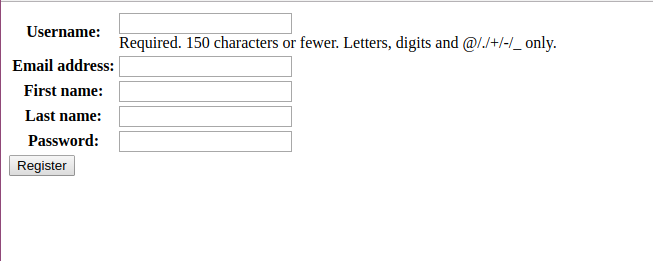
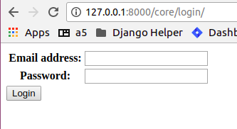
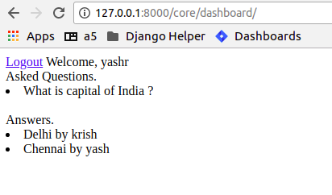

Chapter 6. Building a Quora like site
--------------------------------------------------

Topics in this chapter:
=======================

We have covered basics in last few chapters, like Generic Views, template languages, ORM, interaction with django admin etc. Now in this chapter we will be creating :code:`Custom User`, who will be able to access the Qusetion and answers in the Quora like app.

Quora like Application:
=======================

We have checked Quora for checking many qusetions in our past. Qusetions may be both technical or non technical. In this tutorial we will be creating a Qura like application but not exactly the Quora.

Application Includes:
======================

* Registering custom users (Substitute of django's admin user)
* Custom Users Login/Logout Functionality
* Questions asked by users.
* Answered Questions by Users
* Dashboard user specific.

Django features to learn in this chapter:
==========================================
* Class Based Views
* Basics of Django Testing
* Customising Users

Lets Begin

We will be creating a project from scratch, lets brush-up !!!

.. sourcecode:: bash

    $ django-admin startproject quora
    $ cd quora
    $ python manage.py startapp core // Custom User Trick

.. note::
    Never use the built-in Django User model directly, even if the built-in Django User implementation fulfill all the requirements of your application. *Once you are done with customising your Custom user then only do makemigrations & migrate*

Make custom user:
=================
* Step 1): Goto :code:`core/models.py` and add this
.. sourcecode:: python

    from django.db import models
    from django.contrib.auth.models import AbstractUser

    class User(AbstractUser):
        pass

* Step 2): In your settings.py file add a line just after ALLOWED_HOSTS = [].

.. sourcecode:: python

    AUTH_USER_MODEL = 'core.User' // It can be kept anywhere in the file but good to keep just after Allowed hosts.

.. note::
    Don't forget to add your newly created app to installed apps in :code:`settings.py` file.

.. sourcecode:: python

    INSTALLED_APPS = [
        'django.contrib.admin',
        . . .
        . . .
        'core',
    ]

Congratulations you have customised your Django user Model. now lets migrate changes.

.. sourcecode:: bash

    $ python manage.py makemigrations
    $ python manage.py migrate
    $ python manage.py createsuperuser // follow the instructions

We will now create the Custom user's entry in Django Admin, as by the above process we won't be able to see its entry in Django admin's dashboard. So , in :code:`core/admin.py` we should add :

.. sourcecode:: python

    from django.contrib import admin
    from django.contrib.auth.admin import UserAdmin
    from .models import User

    admin.site.register(User, UserAdmin)

Class Based Views
===================

Class-based views provide an alternative way to implement views as Python objects instead of functions. They do not replace function-based views, but have certain differences and advantages when compared to function-based views:

* Organization of code related to specific HTTP methods (GET, POST, etc.) can be addressed by separate methods instead of conditional branching.

* Object oriented techniques such as mixins (multiple inheritance) can be used to factor code into reusable components.

Example

.. sourcecode:: python

    from django.http import HttpResponse
    // Function Based View.
    def my_view(request):
        if request.method == 'GET':
            # <view logic>
            return HttpResponse('result')

    from django.http import HttpResponse
    from django.views import View
    // Class Based View
    class MyView(View):
        def get(self, request):
            # <view logic>
            return HttpResponse('result')

Register Custom User
=====================

Now that we are aware of Class Based View let's implement **user registration using the same**.

Add the below code to :code:`core/forms.py`

.. sourcecode:: python

    from django import forms
    from .models import User

    class RegisterForm(forms.ModelForm):
        password = forms.CharField(widget=forms.PasswordInput())

        class Meta:
            model = User
            fields = ['email', 'first_name', 'last_name', 'password', 'username']

We will now use the above forms in our views, add the below code to :code:`core/views.py`.

.. sourcecode:: python

    from django.shortcuts import render
    from .forms import RegisterForm
    from django.contrib.auth import login
    from django.contrib.auth.hashers import make_password

    class RegisterView(FormView):

        def get(self, request):
            content = {}
            content['form'] = RegisterForm
            return render(request, 'register.html', content)

        def post(self, request):
            content = {}
            form = RegisterForm(request.POST, request.FILES or None)
            if form.is_valid():
                user = form.save(commit=False)
                user.password = make_password(form.cleaned_data['password'])
                user.save()
                login(request, user)
                return redirect(reverse('dashboard-view'))
            content['form'] = form
            template = 'register.html'
            return render(request, template, content)

There are few thing which we have imported like login(), make_password() etc, it will be good to know about them.

* To log a user in, from a view, use :code:`login()`. It takes an HttpRequest object and a User object. login() saves the user’s ID in the session, using Django’s session framework.
* :code:`make_password` creates a hashed password in the format used by this application. It takes one mandatory argument: the password in plain-text.
* we will talk about :code:`dashboard-view` further in this tutorial. For now just relate it like, once you register yourself you will be redirected to the :code:`dashbord-view`.

Its still not over we still have to make some modifications in settings.py , urls.py and adding of templates. If you have followed previous chapters you may try on your own. Still you can refer to content below.

Add below code to :code:`core/urls.py` and :code:`quora/urls.py` respectively.

.. sourcecode:: python

    from django.urls import path
    from .views import RegisterView

    urlpatterns = [
        path('register/', RegisterView.as_view(), name='register-view'),
    ]

    // quora/urls.py
    from django.contrib import admin
    from django.urls import path, include

    urlpatterns = [
        path('admin/', admin.site.urls),
        path('core/', include('core.urls')),
    ]

Now we will add a new directory to our project as :code:`project/templates` in our case  :code:`quora/templates`. And inside templates directory add a new file :code:`templates/register.html` and add the below code.

.. sourcecode:: html

    <form action="" method="POST">
    
    <table>
        {{ form.as_table }}
    </table>
    <input type="submit" name="register" value="Register" />
    </form>

Runserver and go to :code:`localhost:8000/core/register/`

What next? Take some time and think what will be the next thing to do. And come back to te chapter.

Yes, you are right , after registering the user we will redirect him to his dashboard and also create a way by which he/she could login and logout from the application. And the code for this can be found below.

core/views.py

.. sourcecode:: python

    from django.shortcuts import render
    from django.shortcuts import HttpResponseRedirect, redirect
    from django.urls import reverse
    from django.views.generic.edit import FormView
    from django.utils.decorators import method_decorator
    from django.views.decorators.csrf import csrf_exempt
    from django.contrib.auth import authenticate
    from django.contrib.auth import login, logout
    from django.contrib.auth.hashers import make_password
    from .models import User
    from questans.models import Questions, Answers, QuestionGroups
    from .forms import LoginForm, RegisterForm

    class DashboardView(FormView):

        def get(self, request):
            content = {}
            if request.user.is_authenticated:
                user = request.user
                user.backend = 'django.contrib.core.backends.ModelBackend'
                ques_obj = Questions.objects.filter(user=user)
                content['userdetail'] = user
                content['questions'] = ques_obj
                ans_obj = Answers.objects.filter(question=ques_obj[0])
                content['answers'] = ans_obj
                return render(request, 'dashboard.html', content)
            else:
                return redirect(reverse('login-view'))

    class RegisterView(FormView):

        @method_decorator(csrf_exempt)
        def dispatch(self, request, *args, **kwargs):
            return super(RegisterView, self).dispatch(request, *args, **kwargs)

        def get(self, request):
            content = {}
            content['form'] = RegisterForm
            return render(request, 'register.html', content)

        def post(self, request):
            content = {}
            form = RegisterForm(request.POST, request.FILES or None)
            if form.is_valid():
                save_it = form.save(commit=False)
                save_it.password = make_password(form.cleaned_data['password'])
                save_it.save()
                login(request, save_it)
                return redirect(reverse('dashboard-view'))
            content['form'] = form
            template = 'register.html'
            return render(request, template, content)

    class LoginView(FormView):

        content = {}
        content['form'] = LoginForm

        @method_decorator(csrf_exempt)
        def dispatch(self, request, *args, **kwargs):
            return super(LoginView, self).dispatch(request, *args, **kwargs)

        def get(self, request):
            content = {}
            if request.user.is_authenticated:
                return redirect(reverse('dashboard-view'))
            content['form'] = LoginForm
            return render(request, 'login.html', content)

        def post(self, request):
            content = {}
            email = request.POST['email']
            password = request.POST['password']
            try:
                users = User.objects.filter(email=email)
                user = authenticate(request, username=users.first().username, password=password)
                login(request, user)
                return redirect(reverse('dashboard-view'))
            except Exception as e:
                content = {}
                content['form'] = LoginForm
                content['error'] = 'Unable to login with provided credentials' + e
                return render_to_response('login.html', content)

    class LogoutView(FormView):

        def get(self, request):
            logout(request)
            return HttpResponseRedirect('/')

core/urls.py

.. sourcecode:: python

    from django.contrib import admin
    from django.urls import path
    from .views import LoginView, RegisterView, DashboardView, LogoutView

    urlpatterns = [
        path('login/', LoginView.as_view(), name='login-view'),
        path('register/', RegisterView.as_view(), name='register-view'),
        path('dashboard/', DashboardView.as_view(), name='dashboard-view'),
        path('logout/', LogoutView.as_view(), name='logout-view'),
    ]
We have also configured two more templates i.e., :code:`templates/login.html` and :code:`templates/dashboard.html` with minimal functionality.

.. sourcecode:: django

    // login.html
    <form action="" method="POST">
        
        <table>
            {{ form.as_table }}
        </table>
        <input type="submit" name="login" value="Login" />
    </form>

.. sourcecode:: django

    // dashboard.html
    <a href=''>Logout</a>
    Welcome,
    {{userdetail.username}}
     
    Asked Questions.
     
    
    <li>{{question.title}}</li>
    
     
    Answers.
    
    <li>{{answer.answer_text}} by {{answer.user.username}} </li>
    

So, the login page looks like

and dashboard is like

**Wait**, are we missing something ? Yes, till now we haven't discussed about the adding Questions and Answers in the Quora app, which is the foundation for the application.

Create an app in django let's name it as :code:`questans` and add the below code to its models.

.. sourcecode:: bash

    $ python manage.py startapp questans

Now in :code:`questans/models.py` lets add the below code.

.. sourcecode:: python

    from django.db import models
    from django.conf import settings
    from django.utils.text import slugify

    class Questions(models.Model):
        user = models.ForeignKey(settings.AUTH_USER_MODEL, on_delete=models.CASCADE, null=True, blank=True)
        title = models.TextField()
        group = models.ForeignKey('QuestionGroups', on_delete=models.CASCADE, null=True, blank=True)
        created_on = models.DateTimeField(auto_now=True)
        updated_on = models.DateTimeField(auto_now_add=True)
        slug = models.SlugField()

        def save(self, *args, **kwargs):
            self.slug = slugify(self.title)
            super(Questions, self).save(*args, **kwargs)

        def __str__(self):
            return self.title

    class Answers(models.Model):
        user = models.ForeignKey(settings.AUTH_USER_MODEL, on_delete=models.CASCADE)
        question = models.ForeignKey(Questions, on_delete=models.CASCADE)
        answer_text = models.TextField()
        is_anonymous = models.BooleanField(default=False)

        def __str__(self):
            return self.id

    class QuestionGroups(models.Model):
        name = models.CharField(max_length=100)

        def __str__(self):
            return self.name

Things to note in above code

* In Question models we have created a :code:`slug` field to make it more readable.

* We have also given flexibility for the user to save its answer anonymously.

* QuestionGroup is kept to differentiate question of different topics.

For now we can add questions and answers in the Quora app using its admin and make it more interactive in next part :code:`Quora with bootstrap`. Add the below code to :code:`questans/admin.py`.:align:

.. sourcecode:: python

    from django.contrib import admin
    from .models import Questions, Answers, QuestionGroups

    class AnswerInline(admin.TabularInline):
        model = Answers

    class QuestionsAdmin(admin.ModelAdmin):

        inlines = [AnswerInline]
        class Meta:
            model = Questions

    class QuestionGroupsAdmin(admin.ModelAdmin):

        class Meta:
            QuestionGroups

    admin.site.register(Questions, QuestionsAdmin)
    admin.site.register(QuestionGroups, QuestionGroupsAdmin)

Now our MVP of quora application is ready. We will discuss about Django's Testing Framework.

Basics of Django Testing:
===========================
Django’s unit tests use a Python standard library module: unittest. This module defines tests using a class-based approach

We have described very basic example for testing our appication. Add the below code to :code:`core/tests.py`

.. sourcecode:: python

    from django.test import TestCase
    from .models import User

    class LogInTest(TestCase):
        def setUp(self):
            self.credentials = {
                'username': "demo",
                'email': 'demo@gmail.com',
                'password': 'secret',
                'first_name': 'demo',
                'last_name': 'user',
            }
            User.objects.create_user(**self.credentials)

        def test_register(self):
            response = self.client.post('/core/register/', self.credentials, follow=True)
            self.assertEqual(response.status_code, 200)

        def test_user(self):
            user = User.objects.get(username="demo")
            self.assertEqual(user.username, "demo")

Run tests using the below command.

.. sourcecode:: bash

    $ python manage.py test

