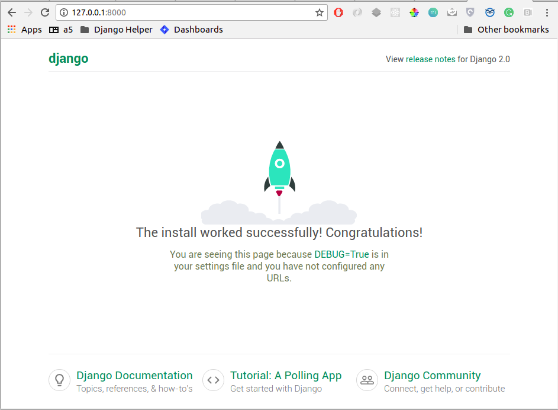
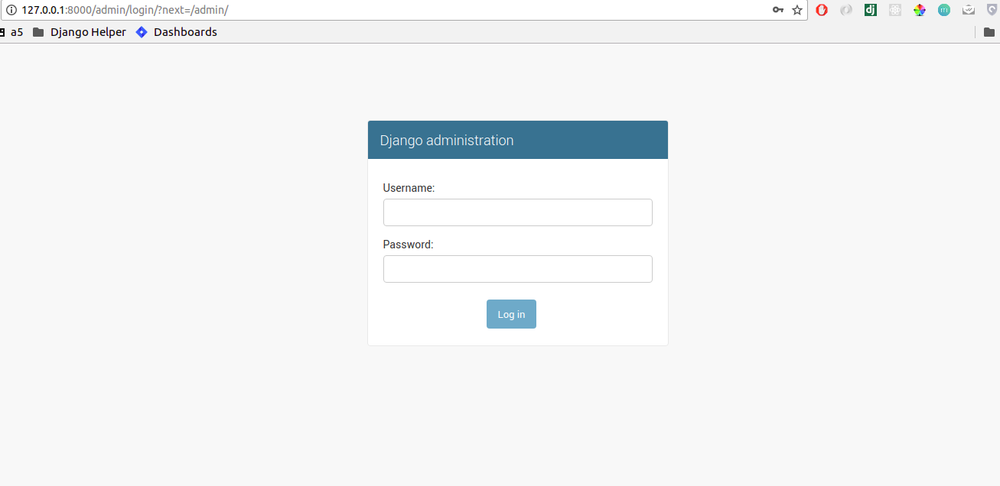
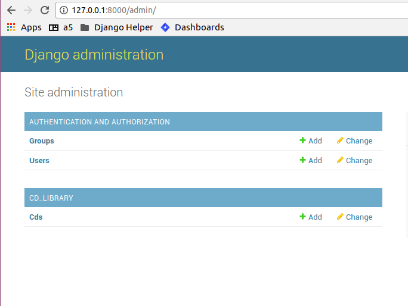

Chapter 2. Building a personal CD library.
--------------------------------------------

Starting a django project
==========================

Now that we have installed django, we are ready to start our project.

A project in django is analogous to a website. Once we have a project ready,
we can host it using any wsgi supported server. More on deploying a django project
later.

django-admin.py is a project utility that ships with django. In addition to the ``startproject``
subcommand, it also includes a lot of helper subcommands that can be useful while maintaining a django
project.

.. note::

    To get a full listing of available subcommands in django-admin.py, use ::

        django-admin.py --help

    To get help on each subcommand, use ::

        django-admin.py help <subcommand>

    For example, here's the result of ``django-admin.py help startproject`` ::

        Creates a Django project directory structure for the given project name in the current directory.

Lets create a project called djen_project::

    django-admin.py startproject djen_project

We can see that the subcommand creates a folder and subfolder called djen_project in the working directory with the following files::

    -- djen_project
    - djen_project
        __init__.py
        settings.py
        urls.py
        wsgi.py
    - manage.py

__init__.py is an empty file required to recognize this project as a python module.

manage.py is a script that is similar to django-admin.py which allows you to manage this project. It has 
subcommands to start a development server, interact with database, backup/restore data etc.

.. note::

    manage.py also has --help switch and help with each subcommand similar to django-admin.py

You can quickly checkout the development server at this point by running::

    python manage.py runserver

Now open http://127.0.0.1:8000 in your browser. you will see django powered page.

settings.py is a list of project wide settings with some default values. You will need to edit this often when
installing new django applications, deployment etc.

You can change the DATABASES settings at this point to make sure your app can be sync'ed later. The easiest 
settings would look like::

    DATABASES = {
        'default': {
            'ENGINE': 'django.db.backends.sqlite3', # Add 'postgresql_psycopg2', 'postgresql', 'mysql', 'sqlite3' or 'oracle'.
            'NAME': 'os.path.join(BASE_DIR, 'db.sqlite3')',      # Or path to database file if using sqlite3.
            'USER': '',                      # Not used with sqlite3.
            'PASSWORD': '',                  # Not used with sqlite3.
            'HOST': '',                      # Set to empty string for localhost. Not used with sqlite3.
            'PORT': '',                      # Set to empty string for default. Not used with sqlite3.
        }
    }

or for a mysql::

    DATABASES = { 
        'default': {
            'ENGINE': 'django.db.backends.mysql', # Add 'postgresql_psycopg2', 'postgresql', 'mysql', 'sqlite3' or 'oracle'.
            'NAME': 'djen_database',                      # Or path to database file if using sqlite3.
            'USER': 'root',                      # Not used with sqlite3.
            'PASSWORD': '****',                  # Not used with sqlite3.
            'HOST': '',                      # Set to empty string for localhost. Not used with sqlite3.
            'PORT': '',                      # Set to empty string for default. Not used with sqlite3.
        }   
    }

We will be using mysql database for examples in this book. Of course, you are free to change
the settings to any other database you like. Just make sure the database exists.

.. note::

    To verify your database settings run::
        
        python manage.py check

    Django will validate your settings and show you errors, if any. If you get this error::

        _mysql_exceptions.OperationalError: (1049, "Unknown database...

    make sure the database given in the settings exists.

.. note::

    It is advised to have a local_settings.py file with exclusively server specific and sensitive settings like database username/password,
    API keys or Secret Key etc and have settings.py import all these values.

    To do this, you would create local_settings.py and include ``from local_settings import *`` at the bottom of settings.py

urls.py is a 'table of contents' of our project (or website). It includes a list of the paths that are to be processed
and responded to.

You are encouraged to go through settings.py and urls.py once to get an understanding of how settings and urls are defined.

Getting started with the App
=============================

Now that we have setup and understood the structure of our project, we can start our application.

To start an application, cd into the project directory and use ::

    manage.py startapp cd_library

This will create a folder called cd_library with the  following files::

    __init__.py
    admin.py
    app.py
    models.py
    tests.py
    views.py

__init__.py is again the file that allows this app to be considered a python module.

models.py will hold the Models of our application. A model is an object of our interest which we want to 
save to the database. If you are familiar with Model-View-Controller(MVC) architecture, you know what models are.
If no, don't worry, we will see and use them in our application.

views.py has all the 'action' of our website. This is similar to the Controller of MVC architecture. Each 'view' function
takes a ``request`` object and returns a ``HttpResponse`` object.

.. note::

    It is recommended to have another urls.py (like the one in project) in the app and include them in the project urls.
    This reduces the clutter in the project urls and provides a namespace kind of resolution between urls. Also, it makes
    it easier to redistribute the app to other projects. As you would expect, reusable apps will depend on the project as 
    little as possible.

Let us create our models first:

Open models.py and define our ``CD`` model which will hold all information related to a CD. You can see that models.py has::

   from django.db import models

So we define the ``CD`` model as::

    GENRE_CHOICES = (
                     ('R', 'Rock'), 
                     ('B', 'Blues'),
                     ('J', 'Jazz'),
                     ('P', 'Pop'),
                    )

    class CD(models.Model):
        title = models.CharField(max_length=100)
        description = models.TextField(null=True, blank=True)
        artist = models.CharField(max_length=40)
        date = models.DateField()
        genre = models.CharField(max_length=1, choices=GENRE_CHOICES)

        def __str__(self):
            return "%s by %s, %s" %(self.title, self.artist, self.date.year)

A little explanation:

* All models should be a subclass of django.db.models.Model

* Each model has a list of fields which will define that model

* We have used CharField, TextField and DateField in this model.

* Each CharField requires a max_length argument which specifies the maximum length of the characters that 
  the field can hold.

* A TextField can contain any number of characters and is suitable for fields such as description, summary, content etc.

* To make the description field optional, we pass the ``null`` and ``blank`` arguments as True

* DateField holds a date. If you need to store the time too, use DateTimeField instead.

* The ``genre`` field should be restricted to a group of values and that can be accomplished by passing an iterable of 2-tuples
  for the value and representation as the choices argument of the CharField.

* The __str__ property of the model defines it's string representation which will be used in the Admin interface, shell etc.

So far, we have defined the CD model, now we need to get it rolling in django:

First, let django know that ``cd_library`` is to be used in the project. To do this, edit the project settings.py and add::

    'cd_library'

to the INSTALLED_APPS list so that your settings.py looks like this::

    INSTALLED_APPS = [
    'django.contrib.admin',
    'django.contrib.auth',
    'django.contrib.contenttypes',
    'django.contrib.sessions',
    'django.contrib.messages',
    'django.contrib.staticfiles',
    'cd_library',
    ]

.. note::

    After modifying INSTALLED_APPS, it's always a good idea to run makmigrations and migrate::

        $ python manage.py makemigrations

        $ python manage.py migrate

    This lets django keep the database and your project in sync. Since we have added an app, 
    django will create that app's tables in the database. If an app is removed from the above 
    list, django will ask you whether to remove the 'stale' tables.

    Also, make sure you have DATABASES settings correctly pointed to the database before syncing.

Well, now that django knows about our app, let us add it to the Admin interface.

A little bit about the admin interface first:

* The admin interface is itself a django app.

* It is a contrib app, which means it is a community contributed app

* It is flexible enough to accommodate any other app's models and have admin actions for them.

Note that the admin app uses a urls.py to keep its urls separate from the project
(as discussed in the note above).

You should create a superuser, to login to django`s inbuild admin panel. ::

    $ python manage.py createsuperuser
    Username (leave blank to use 'agiliq'):
    Email address: user@agiliq.com
    Password:                       # password won't be visible for security reasons.
    Password (again):
    Superuser created successfully.

Remember username and password for logging into the admin panel.

Just to confirm it, you can open http://127.0.0.1:8000/admin/ in your browser. You should see 'Site Administration' and actions for 'Authentication and Authorization'
which are enabled by default.

Now to enable our app's models:

Go to the app's directory i.e. cd_library and create a file called admin.py and add the following lines::

    from django.contrib import admin
    from .models import CD

    admin.site.register(CD)

So, we have 'registered' our ``CD`` model with the admin interface.

If you refresh the admin page, you can see the 'Cd_library' header and 'Cds' under it. Yes this is our app's model
and we can add/edit/delete any instances of our CD model through the admin interface. Try adding a few entries using the
``Add`` action. You can edit entries using the ``Change`` action which will take you to the change list page. Try editing and
deleting entries.

Did you notice?:

* Django uses the models' __str__ property to display the CD in the change list

* Django used our model field types (CharField, TextField, DateField) to create HTML widgets in the admin page

* Genre Field has a drop down field with the CHOICES attributes used to populate its key, value pairs

* DateField includes a handy calendar popup

* Description is optional, so it is not highlighted like the rest of the fields

* Django provides automatic form validation. Try entering blank values, or wrong dates and submitting the form

* In accordance with the DRY principle, models.py is the only place where you specified the fields

With this, we have built our own personal CD library.

An Introduction to the Django ORM
=================================

Now, lets take a look at the raw data that django stores for us.

We have configured the database django uses in 'DATABASES' attribute of settings.py. Notice that
you can enter multiple database settings and use them by providing the ``--database`` switch 
to manage.py subcommands.

To go to the database shell and view the database, use::

    python manage.py dbshell

'dbshell' is a handy manage.py subcommand that will give you access to the database using your DATABASES settings
You can check the tables in the database by doing::

    .tables for  sqlite
    show tables for mysql
    \dt for pgsql

Since we are using mysql for this example, the result is::

    mysql> show tables;
    +----------------------------+
    | Tables_in_djen_database    |
    +----------------------------+
    | auth_group                 |
    | auth_group_permissions     |
    | auth_permission            |
    | auth_user                  |
    | auth_user_groups           |
    | auth_user_user_permissions |
    | cd_library_cd              |
    | django_admin_log           |
    | django_content_type        |
    | django_migrations          |
    | django_session             |
    +----------------------------+
    11 rows in set (0.00 sec)

Each table generally represents a model from an app. You can see that the ``CD`` model is saved as
``cd_library_cd`` table. 

Well, lets look at the structure of this table::

    mysql> desc cd_library_cd;
    +-------------+--------------+------+-----+---------+----------------+
    | Field       | Type         | Null | Key | Default | Extra          |
    +-------------+--------------+------+-----+---------+----------------+
    | id          | int(11)      | NO   | PRI | NULL    | auto_increment |
    | title       | varchar(100) | NO   |     | NULL    |                |
    | description | longtext     | YES  |     | NULL    |                |
    | artist      | varchar(40)  | NO   |     | NULL    |                |
    | date        | date         | NO   |     | NULL    |                |
    | genre       | varchar(1)   | NO   |     | NULL    |                |
    +-------------+--------------+------+-----+---------+----------------+
    6 rows in set (0.00 sec)

I have added a few entries to the CD model, so lets see if they are here::

    mysql> SELECT * FROM cd_library_cd;
    +----+-------+-------------+-----------+------------+-------+
    | id | title | description | artist    | date       | genre |
    +----+-------+-------------+-----------+------------+-------+
    |  1 | Kid A |             | Radiohead | 2010-01-01 | R     |
    +----+-------+-------------+-----------+------------+-------+
    1 row in set (0.01 sec)

.. note::

    Primary key field for an object (id in this case) is autogenerated by django.
    If you need a custom primary key, pass primary_key=True in the field.
    
Django's Object Relational Mapper (ORM) worked behind the scenes to create the tables, sync them with the models, and  add/edit/delete
entries to the tables. 

Now lets try out the ORM first hand. Use the ``shell`` subcommand of ``manage.py``::

    python manage.py shell

.. note::

    use ipython shell for tab-completion, reverse history search and more. django will automatically use
    ipython shell if available

This will take you to the python shell, but within the django environment. So now you can interact with your project

A few examples::

    from cd_library.models import CD

retrieve all cds::

    cds = CD.objects.all()

loop through the cds and print their names::

    for cd in cds:
        print(cd)

add a new CD::

    new_cd = CD()
    new_cd.title = "OK Computer"
    new_cd.artist = "Radiohead"
    new_cd.date = "2000-01-01"
    new_cd.genre = "R"
    new_cd.save()

.. note::

    a model is never saved to the database until the save method is explicitly called

Whats all this:

* Our CD model is mapped to a database table

* A default primary key is used since we have not primary_key on any of the fields

* The default primary key is of the type int and is autoincremented

* The table fields are selected automatically based on model fields

That is really the core of the work of the ORM: mapping classes (or models) to tables. While doing so,
django takes care of the conversion of model fields to database columns, type conversions, primary keys,
constraints and all of that. Thanks to the ORM, you don't have to deal with the databases directly.
In fact, if you were to switch the underlying database by modifying DATABASES in settings, your application
would be least affected by it.

Now that you know a little bit about the ORM, lets see some more utilities it provides:

the object manager::

    CD.objects

objects refers to the default object manager. A manager provides the way of dealing with the database.
Custom managers can be used to provide different 'views' of the model. More on that later.

the get method - to get a single object::

    CD.objects.get(pk=1)

returns::

    <CD: OK Computer by Radiohead, 2000>

that is, a single instance of our CD model. The arguments **must** return a unique object or else
this method will raise ``MultipleObjectsReturned`` error.

.. note::

    arguments to the manager methods include pk for primary key, all model fields and some operators 
    called lookups

Use the get method on when you want to retrieve one record based on the given criteria.

the filter method - to filter the list using given criteria::

    CD.objects.filter(artist='Radiohead')

to get all CDs by Radiohead, returns::

    [<CD: OK Computer by Radiohead, 2000>, <CD: Kid A by Radiohead, 2010>]

which is a list of model instances

the exclude method - equal to all-filter::

    CD.objects.exclude(title='OK Computer')

returns::

    [<CD: Kid A by Radiohead, 2010>]

Now on to the lookups:

How do we get all CDs of the year 2000?

The object manager methods have some special arguments to operate on the fields

to pass date.year as the argument::

    CD.objects.filter(date__year='2000')

Or, get the CDs in genres 'Rock' and 'Pop'::

    CD.objects.filter(genre__in=['R', 'P'])

A few other useful lookups::

    title__startswith
    title__endswith
    date__lte
    date__gte
    title__contains

Use shell to experiment with object manager methods and lookups.
